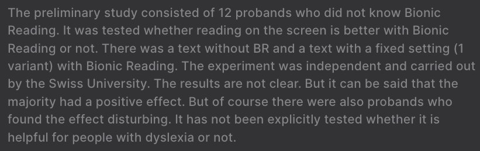

# About Readability

Bionic-Reading is a technique still under study (see `Statements` at the top of [BR Document](https://bionic-reading.com/) or the photo below). So it seems to some people that it doesn't work (or rather it's less readability), but I think it's going to improve over time.

And... I'm not the designer of Bionic-Reading, nor am I the researcher involved. So there's nothing I can say about this.

I'm sorry if I didn't help you. Thank you for reading it.
