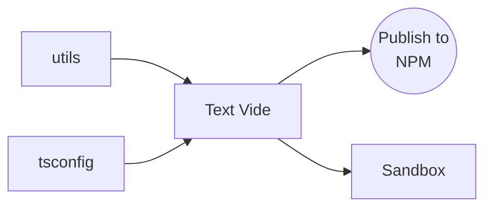

# Contributing

## Setup

```bash
git clone https://github.com/<username>/text-vide.git
cd text-vide

pnpm install
pnpm dev # run sandbox application (:3000)
pnpm test
pnpm lint
pnpm build
```

## Project structure

```
.
├── apps/
│   └── sandbox/
└── packages/
    ├── text-vide/    <-- core
    ├── tsconfig/
    └── utils/
```


